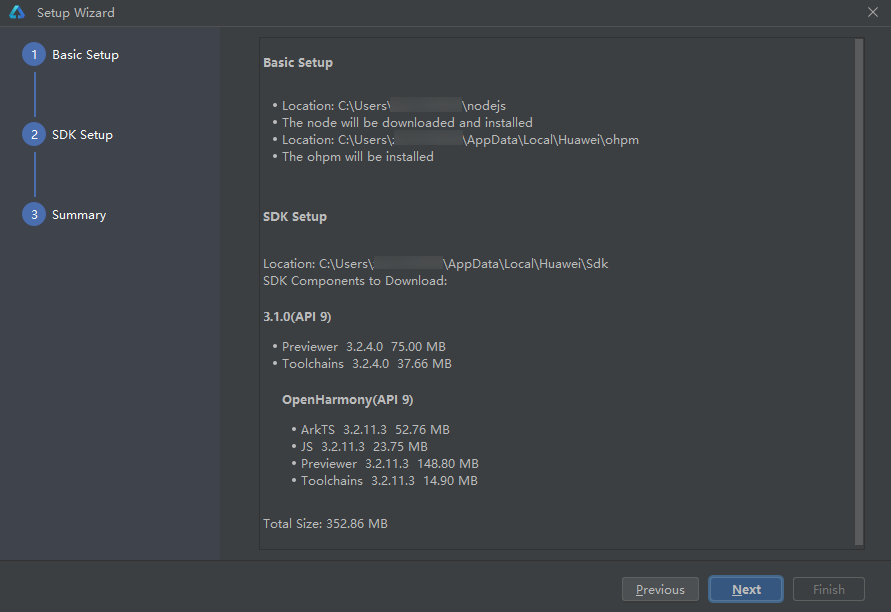
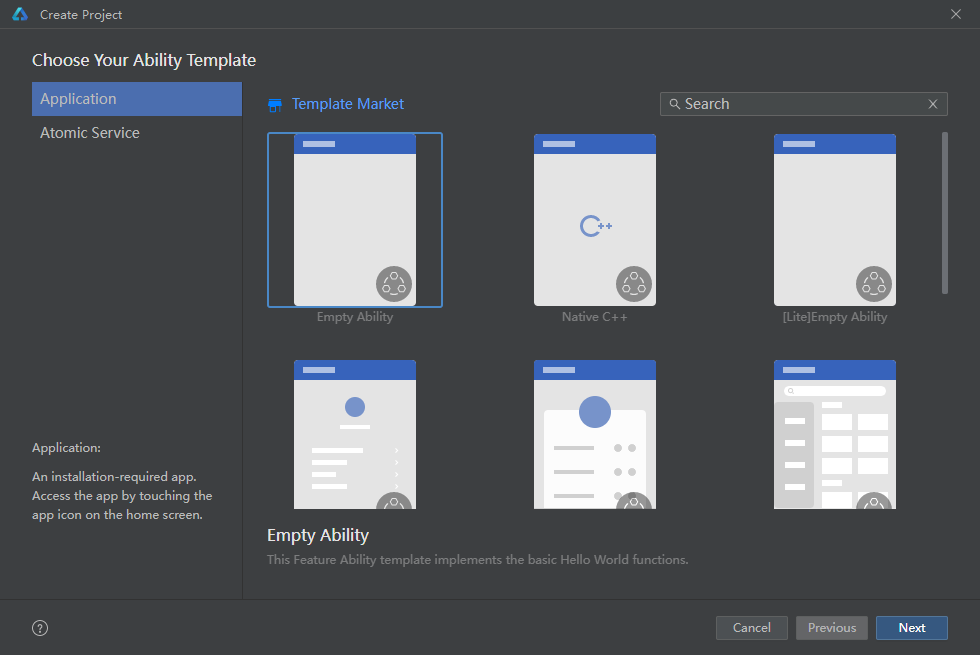

# 下载安装

[下载地址]([HUAWEI DevEco Studio和SDK下载和升级 | HarmonyOS开发者](https://developer.harmonyos.com/cn/develop/deveco-studio/))

按照[官方安装教程]([配置开发环境-快速开始-DevEco Studio使用指南-工具-HarmonyOS应用开发](https://developer.harmonyos.com/cn/docs/documentation/doc-guides-V3/environment_config-0000001052902427-V3#ZH-CN_TOPIC_0000001622801969__li16357151616451))走，我没有配置代理那一步也能正差运行。

# 创建项目

创建页和Android Studio 差不多，我们选择第一个就好，填好包名和路径完成

# 运行遇到的问题

1. compileSdkVersion and releaseType of the app do not match the apiVersion and releaseType on the device.

看提示我貌似是我的垃圾手机不止这个3.1这个版本。看了我的手机是3.0.（可能用虚拟机没有这个问题，虚拟机要额外安装这里就先不试了）

compileSdkVersion改成8试试，还是不行

 ERROR: API version 8 does not support the Stage model. 

提示：8不支持模型

解决：重新创建API3.0的项目

2. Failure[INSTALL_FAILED_NO_BUNDLE_SIGNATURE]
   Open signing configs

解决：没有登录 按提示登录即可

终于运行完成

